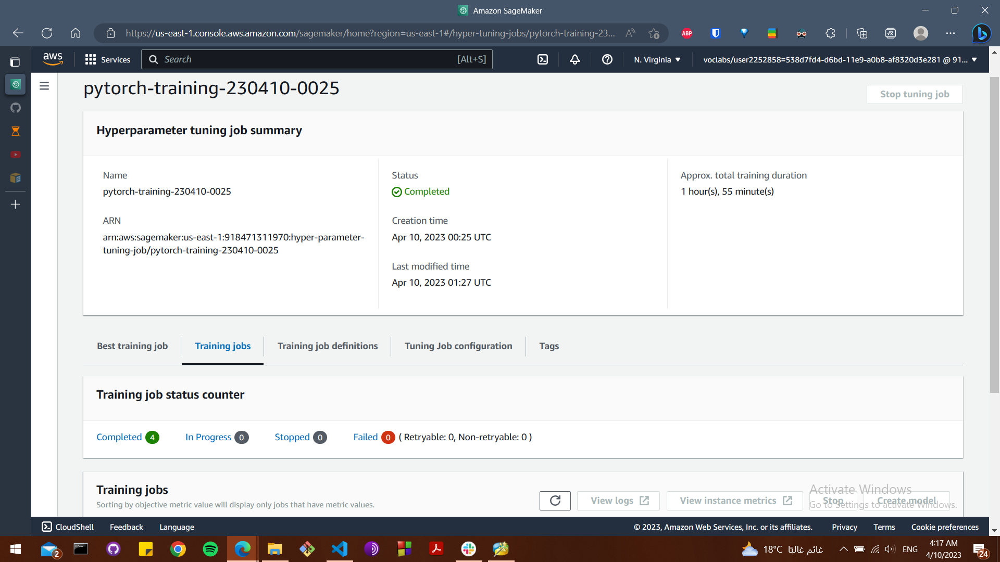
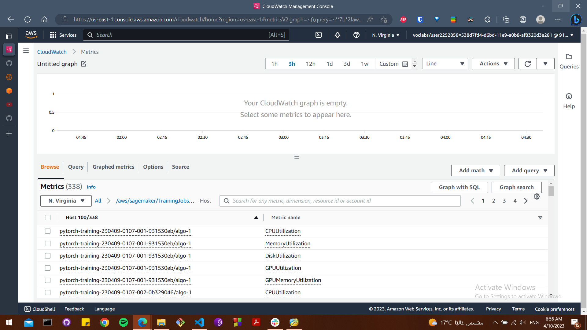
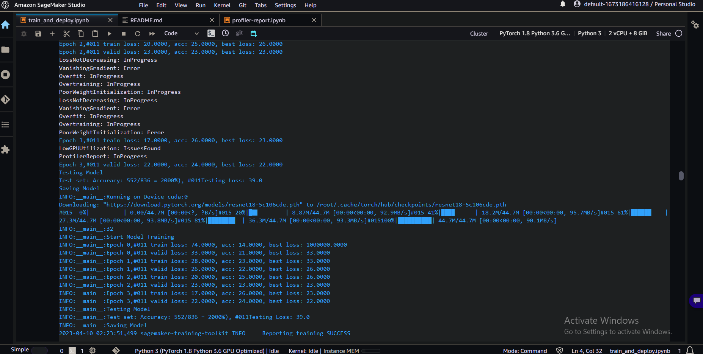
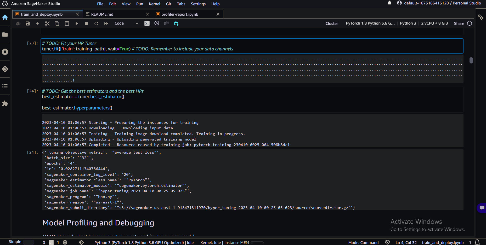
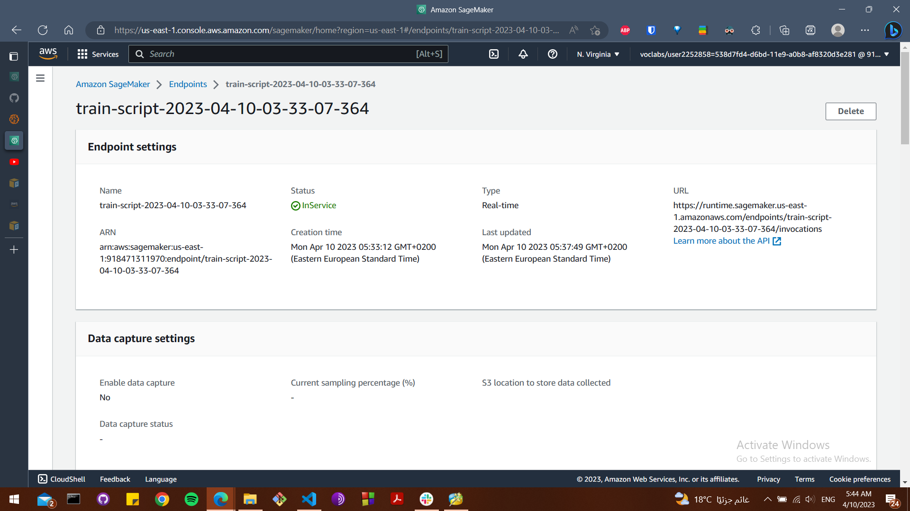
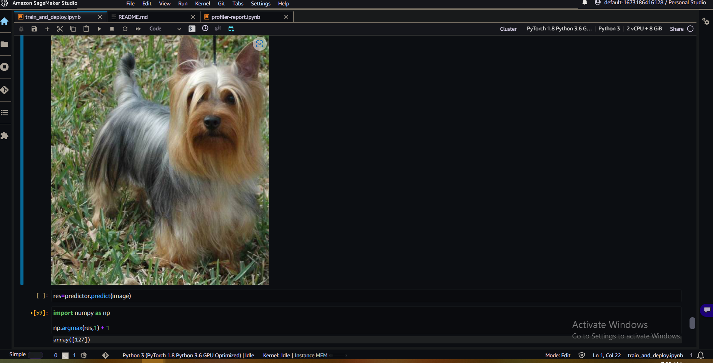

# Image Classification using AWS SageMaker

Use AWS Sagemaker to train a pretrained model that can perform image classification by using the Sagemaker profiling, debugger, hyperparameter tuning and other good ML engineering practices. This can be done on either the provided dog breed classication data set or one of your choice.

## Project Set Up and Installation
Enter AWS through the gateway in the course and open SageMaker Studio. 
Download the starter files.
Download/Make the dataset available. 

## Dataset
The provided dataset is the dogbreed classification dataset which can be found in the classroom.
The project is designed to be dataset independent so if there is a dataset that is more interesting or relevant to your work, you are welcome to use it to complete the project.

### Access
Upload the data to an S3 bucket through the AWS Gateway so that SageMaker has access to the data. 

## Hyperparameter Tuning

This part to finetune a pretrained model with hyperparameter tuning .

Choosing a pre-trained Resnet18 model and using transfer learning to train the model on our dataset we can save a lot of time and resources and give our model a headstart rather than start from the beginning.

Resnet18 model is a well-known and widely-used model that has achieved good results on a variety of image classification tasks. It is a good choice for many tasks because it is relatively lightweight and efficient, yet still has good performance.

Enhancing the performance of the model by Sagemaker's hyperparameter tuning capabilitiesfor the model including:
- defining wide range of values to test our hyperparameters
- Set multiple training jobs to find the best combination of hyperparameters
- Use sagemaker tuner to find the best set of hyperparameters

1. Finished training  jobs

2. Logs metrics during the training process

3. Tuning Hyperparameters

4. Best Hyperparameters

## Debugging and Profiling

To improve performance with accuracy of the model, I used Sagemaker profiling and debugging tools to identify and address issues in the training process.

To perform and evaluate the results of model debugging and profiling in Sagemaker:

1. Set up the Sagemaker debugger and profiler. 

2. Start the training job. This will initiate the training process and enable the debugger and profiler to collect data and identify issues with the model's training and evaluation processes.

3. Monitor the progress of the training job using the AWS Management Console.

Analyze the results of the debugging and profiling to identify and address any issues with the model's training and evaluation processes. 

### Results

Insights in the report was based on the Batch size hyper parameter. This allowed to test with multiple batch size. 

Reports from profiler:

[Profiler Report Notebook](profiler-report.ipynb)

[Profiler Report HTML](profiler-report.html)

## Model Deployment

Deplying the model on an endpoint to be able to use it in prediction 

Using it for prediction

