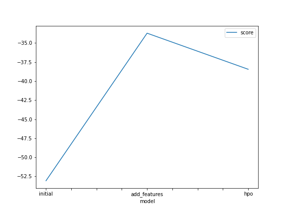
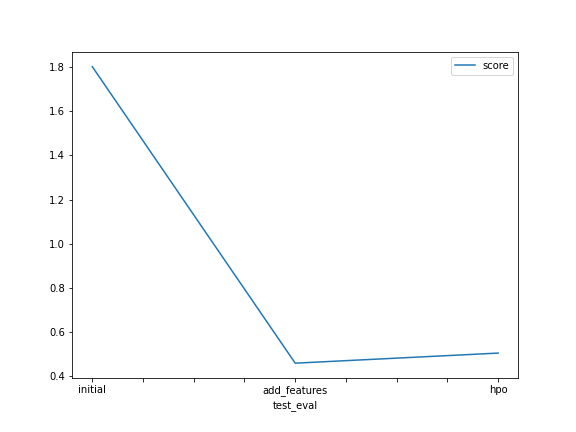

# Report: Predict Bike Sharing Demand with AutoGluon Solution

Muhammed Magdy

## Initial Training

### What did you realize when you tried to submit your predictions? What changes were needed to the output of the predictor to submit your results?

All predictions needed to be > 0

### What was the top ranked model that performed?

WeightedEnsemble_L3

## Exploratory data analysis and feature creation

### What did the exploratory analysis find and how did you add additional features?

I found that holiday, workingday, season, and weather are categorical data. Extracted hour, month, and date from datetime column

### How much better did your model preform after adding additional features and why do you think that is?

It performed nearly 3 times better. I think it is because the good new features and better choice of types

## Hyper parameter tuning

### How much better did your model preform after trying different hyper parameters?

Not as much as before but I think if trained longer and tuned more hyperparameters would get us more accurate data

### If you were given more time with this dataset, where do you think you would spend more time?

I will try to get relation between rush hour and days, weekend rush hour and weekday rush hours and compare between different seasons

### Create a table with the models you ran, the hyperparameters modified, and the kaggle score.

| model        | hpo1 | hpo2            | hpo3   | score   |
| ------------ | ---- | --------------- | ------ | ------- |
| initial      | 600  | 'best'\_quality | 'rmse' | 1.80155 |
| add_features | 600  | 'best_quality'  | 'rmse' | 0.45915 |
| hpo          | 900  | 'best_quality'  | 'rmse' | 0.50480 |

### Create a line plot showing the top model score for the three (or more) training runs during the project.

### Create a line plot showing the top kaggle score for the three (or more) prediction submissions during the project.

## Summary

This dataset is most suitable for regression.
With more feature engineering and hyperparameter optimization we could get better score.
